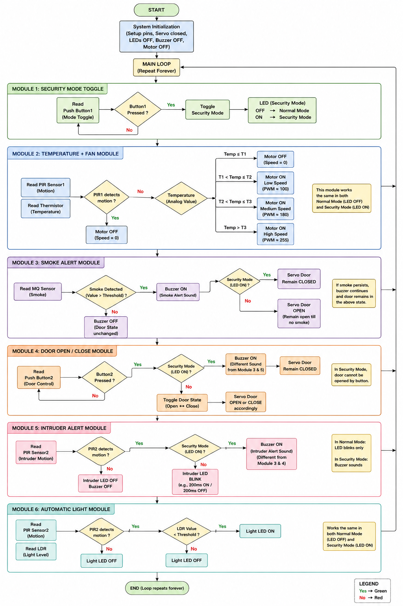
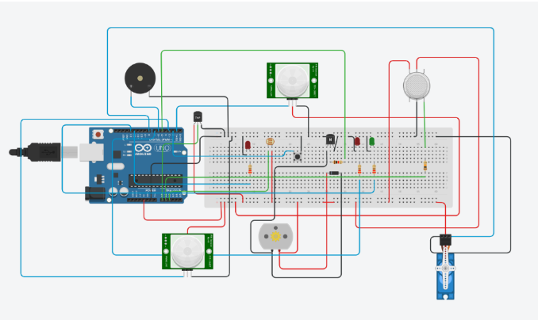
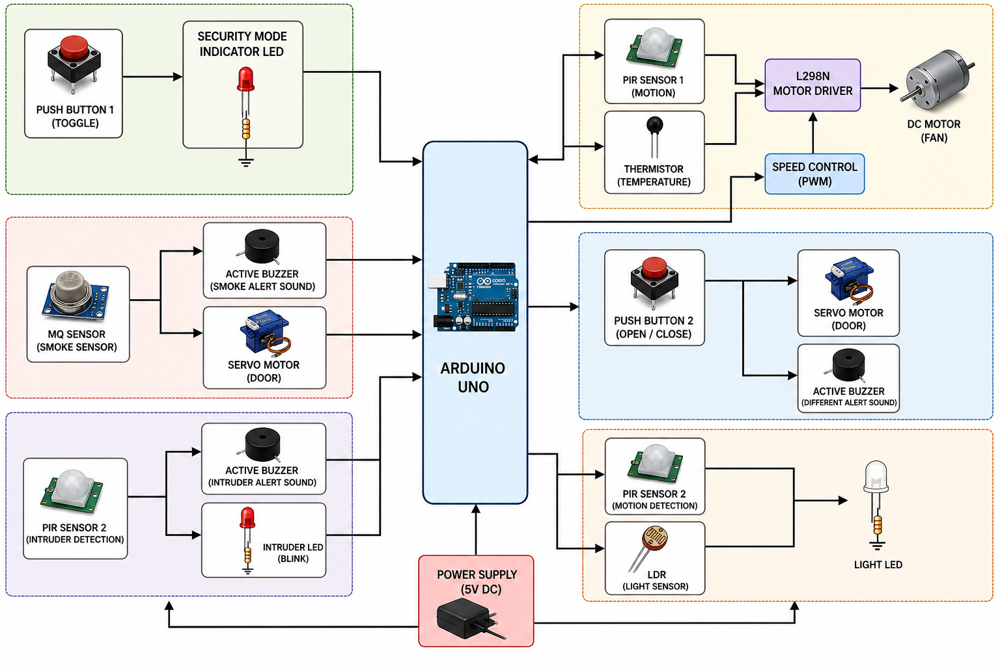

# Smart Home Automation System with Real-Time Monitoring and Actuation
## Overview
This project presents a Smart Home Automation System developed using Arduino and multiple sensors for real-time monitoring, automatic appliance control, and home safety enhancement. The system is designed to improve convenience, security, and energy efficiency through embedded automation techniques.

## Features
- Smoke and gas leakage detection
- Automatic lighting control using LDR
- Temperature-based fan operation
- Security alert mechanism
- Real-time environmental monitoring
- Embedded system-based automation

## Components Used
- Arduino UNO
- MQ2 Smoke Sensor
- LDR (Light Dependent Resistor)
- Temperature Sensor
- Relay Module
- DC Fan
- LEDs
- Buzzer
- Jumper Wires
- Breadboard

## Software Used
- Arduino IDE
- TinkerCad
- Fritzing

## Working Principle
The system continuously monitors environmental conditions using different sensors connected to the Arduino microcontroller. Based on the sensor readings, the controller automatically performs actions such as turning ON lights in low-light conditions, activating the fan during temperature rise and triggering alerts during smoke detection. This enables intelligent and automated home monitoring.

## Project Images

### System Architecture

### Software Flowchart

### Circuit Diagram

### Block Diagram

### Final Output

## Applications
- Smart Home Systems
- Safety and Security Monitoring
- Energy-Efficient Automation
- Embedded and IoT-Based Applications

## Future Improvements
- IoT-based mobile application control
- Wi-Fi monitoring using ESP8266
- Cloud-based data logging
- Voice assistant integration

## Author
V.P. Siddeshwaran
B.E. Electronics and Communication Engineering
